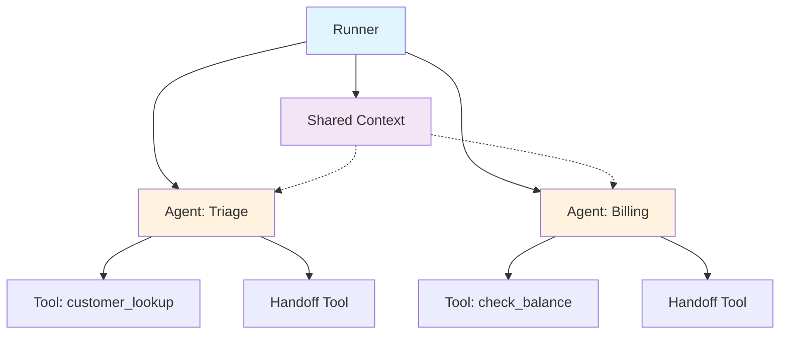
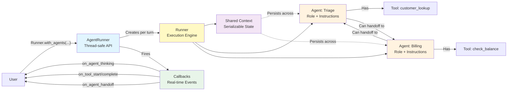
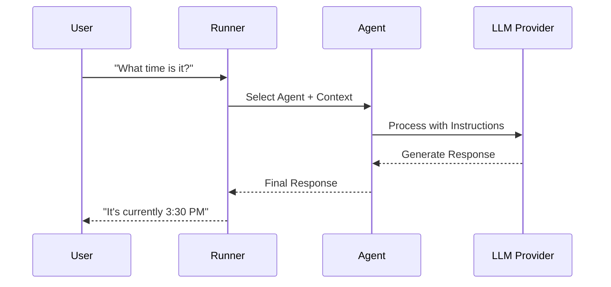
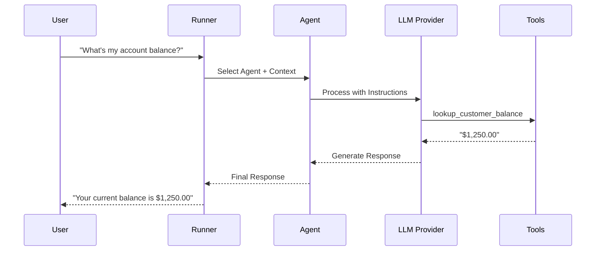
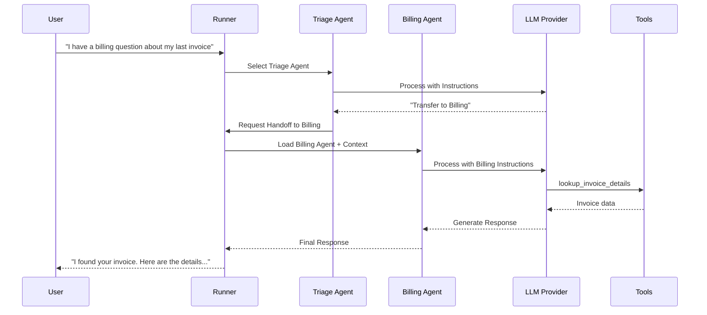

```mermaid
graph TD
    R[Runner]
    C[Shared Context]

    R --> C

    A1[Agent: Triage]
    A2[Agent: Billing]

    R --> A1
    R --> A2

    T1[Tool: customer_lookup]
    H1[Handoff Tool]

    T2[Tool: check_balance]
    H2[Handoff Tool]

    A1 --> T1
    A1 --> H1

    A2 --> T2
    A2 --> H2

    C -.-> A1
    C -.-> A2

    style R fill:#e1f5fe
    style C fill:#f3e5f5
    style A1 fill:#fff3e0
    style A2 fill:#fff3e0
```

---

## Almost Full Architecture

```mermaid
graph LR
    U[User] -->|"Runner.with_agents(...)"| AR[AgentRunner<br/>Thread-safe API]

    AR -->|"Creates per turn"| R[Runner<br/>Execution Engine]

    R --> C[Shared Context<br/>Serializable State]

    R --> A1[Agent: Triage<br/>Role + Instructions]
    R --> A2[Agent: Billing<br/>Role + Instructions]

    A1 -->|"Has"| T1[Tool: customer_lookup]
    A1 -->|"Can handoff to"| A2

    A2 -->|"Has"| T2[Tool: check_balance]
    A2 -->|"Can handoff to"| A1

    AR -->|"Fires"| CB[Callbacks<br/>Real-time Events]

    C -.->|"Persists across"| A1
    C -.->|"Persists across"| A2

    CB -->|"on_agent_thinking"| U
    CB -->|"on_tool_start/complete"| U
    CB -->|"on_agent_handoff"| U

    style AR fill:#e1f5fe
    style R fill:#fff9c4
    style C fill:#f3e5f5
    style A1 fill:#fff3e0
    style A2 fill:#fff3e0
    style CB fill:#e8f5e9
```

---

```mermaid
sequenceDiagram
    participant U as User
    participant AR as Runner
    participant A as Agent
    participant LLM as LLM Provider

    U->>AR: "What time is it?"
    AR->>A: Select Agent + Context
    A->>LLM: Process with Instructions
    LLM-->>A: Generate Response
    A-->>AR: Final Response
    AR-->>U: "It's currently 3:30 PM"
```

---

```mermaid
sequenceDiagram
    participant U as User
    participant AR as Runner
    participant A as Agent
    participant LLM as LLM Provider
    participant T as Tools

    U->>AR: "What's my account balance?"
    AR->>A: Select Agent + Context
    A->>LLM: Process with Instructions
    LLM->>T: lookup_customer_balance
    T-->>LLM: "$1,250.00"
    LLM-->>A: Generate Response
    A-->>AR: Final Response
    AR-->>U: "Your current balance is $1,250.00"
```

---

```mermaid
sequenceDiagram
    participant U as User
    participant AR as Runner
    participant A1 as Triage Agent
    participant A2 as Billing Agent
    participant LLM as LLM Provider
    participant T as Tools

    U->>AR: "I have a billing question about my last invoice"
    AR->>A1: Select Triage Agent
    A1->>LLM: Process with Instructions
    LLM-->>A1: "Transfer to Billing"
    A1->>AR: Request Handoff to Billing
    AR->>A2: Load Billing Agent + Context
    A2->>LLM: Process with Billing Instructions
    LLM->>T: lookup_invoice_details
    T-->>LLM: Invoice data
    LLM-->>A2: Generate Response
    A2-->>AR: Final Response
    AR-->>U: "I found your invoice. Here are the details..."
```

---
