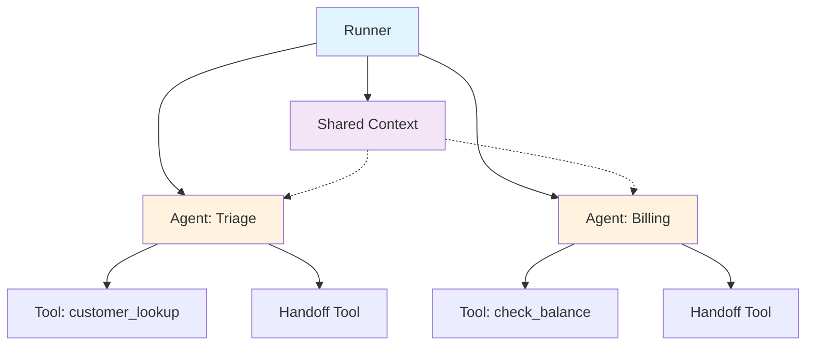
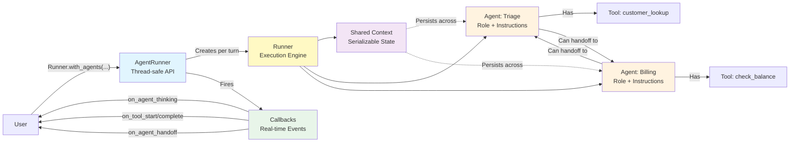
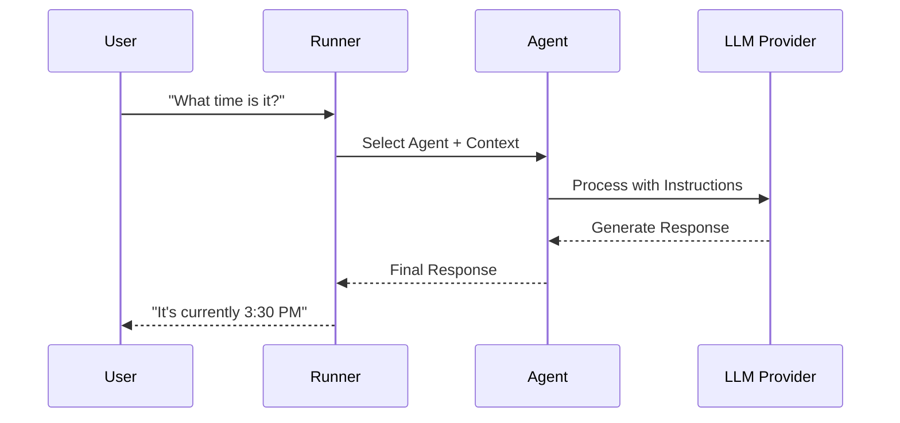
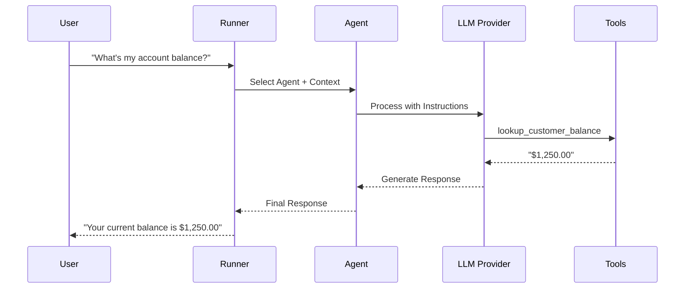
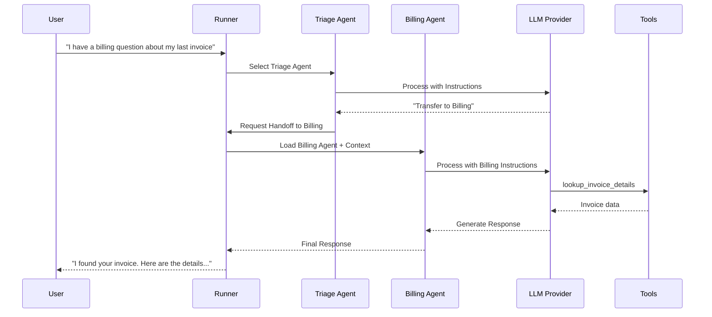

# ai-agents sdk

---

```rb{all|2-17|20-22|24-26|2-5|7-11|12-17|20|21-22|24|26|all}
# Create specialized agents
triage = Agents::Agent.new(
  name: "Triage Agent",
  instructions: "Route customers to the right specialist"
)

sales = Agents::Agent.new(
  name: "Sales Agent",
  instructions: "Answer details about plans",
  tools: [CreateLeadTool.new, CRMLookupTool.new]
)

support = Agents::Agent.new(
  name: "Support Agent",
  instructions: "Handle account realted and technical issues",
  tools: [FaqLookupTool.new, TicketTool.new]
)

# Wire up handoff relationships - clean and simple!
triage.register_handoffs(sales, support)
sales.register_handoffs(triage)     # Can route back to triage
support.register_handoffs(triage)   # Hub-and-spoke pattern

runner = Agents::Runner.with_agents(triage, sales, support)

result = runner.run("Do you have special plans for businesses?")
```

---

## Project Structure

  -   `lib/agents.rb`: The main entry point, handling configuration and loading other components.
  -   `lib/agents/agent.rb`: Defines the `Agent` class, which represents an individual AI agent with role, instructions, and tools.
  -   `lib/agents/tool.rb`: Defines the `Tool` class, the base for creating custom tools that agents can execute.
  -   `lib/agents/agent_runner.rb`: Thread-safe wrapper that manages the agent registry and provides the public API for running conversations.
  -   `lib/agents/runner.rb`: Internal execution engine that handles individual conversation turns. The `Runner.with_agents` factory method returns an `AgentRunner` instance.
  -   `lib/agents/context.rb`: Manages conversation state that persists across agent interactions and handoffs.

---

## Key Concepts

-   **Agent**: An AI assistant with a specific role, instructions, and tools. Each agent can register handoffs to other agents.
-   **Tool**: A custom function that an agent can use to perform actions (e.g., look up customer data, send an email). Tools are thread-safe and receive context as parameters.
-   **Handoff**: The process of transferring a conversation from one agent to another. This happens seamlessly without the user knowing.
-   **AgentRunner**: The thread-safe public API for managing multi-agent conversations. Created via `Runner.with_agents(...)`.
-   **Runner**: Internal execution engine that handles individual conversation turns. Each call to `AgentRunner.run` creates a new Runner instance.
-   **Context**: A shared state object that stores conversation history and agent information, fully serializable for persistence across process boundaries.
-   **Callbacks**: Event hooks for monitoring agent execution in real-time, including agent thinking, tool start/complete, and handoffs. Non-blocking and thread-safe.

---



---

## Almost Full Architecture



---



---



---



---

## Best Practices

- Make sure the scope of sub agents don't overlap
- Use different models for different use cases
- The best tool call is the one that is not executed
- Agents Error Compound
- Cost increases quadratically

---
